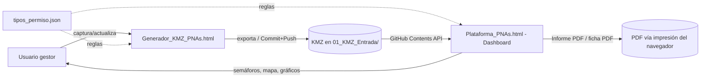
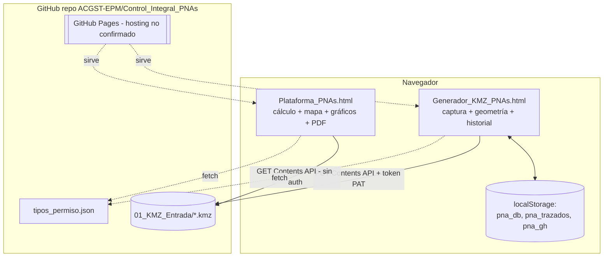
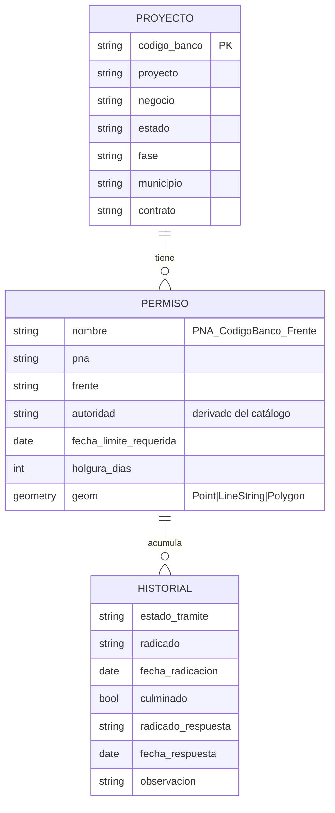
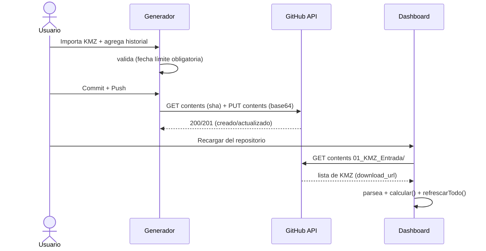

# PROJECT_CONTEXT.md — Plataforma Control Integral PNAs

> Documento de contexto técnico para **reiniciar el trabajo en una conversación nueva** de Claude Code sin acceso al historial previo.
> Generado a partir del **código, archivos y configuración reales** del repositorio (rama `Control_Integral_PNAs`, último commit `378ac73`, fecha commit **2026-08-28**).
> Fecha de generación de este documento: **2026-09 (aprox.)**.
>
> **Convenciones de incertidumbre usadas en este documento:**
> - `[NO DETERMINADO]` — no pudo establecerse con seguridad desde el código/archivos.
> - `[CONFLICTO DETECTADO]` — hay información contradictoria entre fuentes.
> - `[REQUIERE CONFIRMACIÓN]` — decisión que debe confirmarse con el propietario antes de continuar.

---

## 1. IDENTIDAD DEL PROYECTO

| Campo | Valor |
|---|---|
| **Nombre** | Plataforma Control Integral PNAs |
| **Organización** | Grupo EPM · Centro de Gestión Servicios Técnicos |
| **Repositorio** | `ACGST-EPM/Control_Integral_PNAs` (GitHub) |
| **Rama principal (default)** | `Control_Integral_PNAs` (NO es `main`) |
| **Estado** | Fase 1 funcional y en uso; publicación/hosting sin resolver (ver §22 y §24) |

**Descripción corta.** Herramienta web **100 % del lado del navegador** (sin backend) para gestionar el **ciclo de vida de permisos geoespaciales (PNAs)** de proyectos de infraestructura de EPM: capturarlos, ubicarlos en un mapa, calcular semáforos de riesgo y generar informes.

**Propósito / problema que resuelve.** Un **PNA (Permiso No Ambiental)** es una autorización que un tercero (municipio, INVIAS, ANI, Gobernación) debe otorgar antes de intervenir una vía o su zona. Su atraso **frena la ejecución del proyecto y del contrato**. Antes la gestión se dispersaba en correos y archivos sueltos. La plataforma centraliza cada permiso, responde **"¿se inició (radicó) a tiempo?"** y **"¿se obtendrá antes de que el proyecto lo necesite?"**, y muestra el riesgo con semáforos.

**Usuario objetivo.** Personal técnico de EPM que gestiona permisos (perfil gestor/analista, no necesariamente desarrollador). El propietario principal de esta fase es un usuario **no técnico** (`leydim007@gmail.com`).

**Casos de uso principales.**
1. Registrar un permiso nuevo de un proyecto (Generador) y exportar/publicar su KMZ.
2. Agregar el avance de un trámite (nueva fila de historial) a un permiso existente.
3. Ver en el Dashboard el estado y riesgo de todos los permisos, filtrar y analizar en el mapa.
4. Generar un informe PDF (general filtrado o ficha por permiso).
5. Simular la gestión en una fecha distinta a hoy ("recorrido temporal").

**Alcance actual (Fase 1).** 5 tipos de permiso; captura + almacenamiento en KMZ; dashboard geoespacial con semáforos, filtros, gráficos, recorrido temporal e informes PDF; publicación del KMZ a GitHub desde el navegador.

**Alcance que NO forma parte del proyecto (explícitamente descartado o fuera de fase).**
- Integración con los PMTs de obra (solo se trabajan los 5 PNAs listados). *(confirmado en el historial de decisiones)*
- Detección automática de conflictos geoespaciales entre permisos. *(descartado en Fase 1)*
- Backend, base de datos server-side, autenticación de usuarios.
- Control de acceso "solo invitados" a la URL (ver §17 y §22).

**Stack tecnológico (resumen).** HTML + CSS + JavaScript vanilla en 2 páginas autónomas, con librerías por CDN (Leaflet, JSZip, Bootstrap 5, DataTables, Select2, jQuery). Datos en archivos **KMZ**. Catálogo de reglas en **`tipos_permiso.json`**. Persistencia local con `localStorage`. Integración con **GitHub REST Contents API**. Detalle completo en §4.

---

## 2. OBJETIVO FUNCIONAL

La herramienta son **dos aplicaciones HTML independientes** que se comunican mediante archivos KMZ guardados en el repositorio:

- **`Generador_KMZ_PNAs.html`** — captura permisos y produce/publica el KMZ.
- **`Plataforma_PNAs.html`** — dashboard que lee los KMZ y muestra el análisis.

### Funcionalidades del Dashboard
- Carga automática de los KMZ de la carpeta `01_KMZ_Entrada/` (cuando se abre desde GitHub Pages) o carga manual local ("Cargar KMZ").
- Cálculo por permiso de: **% de avance**, **semáforo de gestión** (reloj normativo), **semáforo de riesgo/obtención**, **semáforo de inicio**, e **itinerancia** (nivel para el mapa).
- **KPIs**: Permisos · Activados/Obtenidos · En gestión · En riesgo (Permisos | Proyectos).
- **Gráficos** (SVG puro): Avance del trámite (agrupado Negocio › Proyecto › Permisos), Permisos por Proyecto, por Negocio, por Autoridad.
- **Mapa** (Leaflet) que colorea **una sola dimensión a la vez** vía conmutador **Riesgo / Autoridad**; el tipo de permiso (PNA) es una **etiqueta** sobre la geometría (visible al acercar el zoom ≥ 15).
- **9 filtros** (Select2) + **Recorrido temporal** (modo simulación de "fecha de análisis").
- **Tabla** "Información de trámites (PNAs)" con exportación a Excel (DataTables Buttons) y columna **Resumen** con acción PDF por fila.
- **Informe PDF** general (con lo filtrado) y **ficha PDF** por permiso (impresión del navegador).

### Entradas / Procesamiento / Salidas
- **Entradas:** archivos KMZ (geometría + descripción con campos e historial), catálogo `tipos_permiso.json`, y las selecciones de filtros/recorrido del usuario.
- **Procesamiento:** parseo de KMZ→KML→DOM; `calcular(p)` deriva semáforos/avance/itinerancia; días **hábiles** para umbrales.
- **Salidas:** vistas del dashboard (mapa/gráficos/tabla/KPIs), PDFs (impresión), y KMZ publicado a GitHub (desde el Generador).

### Reglas de negocio clave (ver detalle en §16 y Glosario §28)
- **% de avance** por estado (desde `avance_estados` del catálogo).
- **Semáforo de riesgo (obtención)** = días **hábiles** hasta `fecha_limite_requerida − holgura`. Umbrales: **≠PMT** verde ≥ 45 / amarillo 30–45 / rojo < 30; **PMT** verde ≥ 30 / amarillo 20–30 / rojo < 20.
- **"Listo/Activado"**: `PMT_Diseño` solo con estado `Aprobado`; los demás al alcanzar **100 %** de avance.
- **Itinerancia**: sin radicar → días hábiles a la **fecha máxima de radicación** (`límite − plazo − holgura`); en proceso → días hábiles al **límite**; si falta la fecha límite → estado `sinfecha` (anillo naranja/morado punteado); si `listo` → sin itinerancia.
- **Fecha límite requerida** es **obligatoria** en el Generador (bloquea guardar si falta).

### Flujo de datos (Mermaid)


### Manejo de errores (observado)
- Fetch al repo falla → mensaje "No se pudo leer el repositorio. Usa 'Cargar KMZ'." (no rompe la app).
- KMZ sin fecha límite → estado `sinfecha` / `⚠ Falta fecha límite` (no inventa color de riesgo).
- Publicación a GitHub: distingue 401 (token inválido), 403 (sin permiso Contents), otros (muestra el mensaje del API).

---

## 3. ARQUITECTURA

**Arquitectura general.** Cliente estático puro. No hay servidor propio, ni base de datos, ni proceso backend. El "almacén" es el conjunto de archivos KMZ versionados en Git. El "backend de lectura/escritura" es la **API REST de GitHub** consumida directamente desde el navegador.



**Componentes y responsabilidades.**
- **Frontend:** las dos páginas HTML (todo el código, estilos y lógica están inline en cada archivo).
- **Backend/APIs:** ninguno propio. Se usa la **GitHub REST Contents API** (lectura sin auth en repo público; escritura con PAT desde el Generador).
- **Base de datos / persistencia:** archivos KMZ (almacén oficial) + `localStorage` (sesión de trabajo y config del Generador). Ver §7.
- **Autenticación/autorización:** ninguna de usuario final. El Generador tiene una **clave de administrador** (gate client-side por hash SHA-256) para desbloquear la "Base de proyectos". La escritura a GitHub usa un **PAT fine-grained** que el usuario pega y se guarda en `localStorage`. Ver §13.
- **Servicios externos:** GitHub (API + hosting), CDNs de librerías, tiles de OpenStreetMap. Ver §11–§12.
- **Procesamiento asíncrono / jobs / webhooks / cache / storage server-side:** **no aplica** (no existen).
- **Comunicación entre componentes:** Generador y Dashboard NO se comunican en vivo; el único canal es el archivo KMZ en el repo.

---

## 4. STACK TECNOLÓGICO

| Categoría | Tecnología | Versión | Uso | Observaciones |
|---|---|---|---|---|
| Lenguaje | HTML/CSS/JavaScript (vanilla) | ES2017+ | Toda la app | Sin transpilación |
| Runtime | Navegador web | — | Ejecución | Sin Node en runtime |
| Mapa | Leaflet | 1.9.4 | Mapa e interacción | CDN unpkg |
| Basemap (tiles) | OpenStreetMap estándar | — | Fondo del mapa | `tile.openstreetmap.org` — **[CONFLICTO DETECTADO]** el commit `5262915` menciona "CartoDB Positron" pero el código actual usa OSM |
| KMZ (zip) | JSZip | 3.10.1 (y **3.1.3**) | Leer/escribir KMZ y export Excel | **[CONFLICTO DETECTADO]** el Dashboard carga JSZip **dos veces** (3.10.1 en `<head>` y 3.1.3 para `buttons.html5`); gana el último cargado. Funciona pero es frágil |
| UI framework | Bootstrap | 5.3.0 | Layout y componentes | CDN jsdelivr |
| Tabla | DataTables | 1.13.4 | Tabla + orden + paginación | + Buttons 2.3.6 (Excel) |
| Selects | Select2 | 4.1.0-rc.0 | Filtros multiselección | + tema bootstrap-5 1.3.0 |
| DOM/utilidades | jQuery | 3.6.0 | Requerido por DataTables/Select2 | CDN code.jquery.com |
| Gráficos | SVG "a mano" | — | Donut/barras/distribuciones | Sin librería de charts |
| Catálogo de reglas | JSON | `_meta.version` = **1.0** | Fuente única de verdad | `tipos_permiso.json` |
| Persistencia local | Web Storage API (`localStorage`) | — | Sesión Generador + config | Claves: `pna_db`, `pna_trazados`, `pna_gh` |
| API externa | GitHub REST Contents API | v3 (`application/vnd.github+json`) | Leer/publicar KMZ | Ver §11 |
| Hosting | GitHub Pages | — | Servir las páginas | **[REQUIERE CONFIRMACIÓN]** — no se confirma que esté activado; ver §22 |
| Package manager | — | — | — | **No hay** (no `package.json`) |
| ORM / DB server | — | — | — | **No aplica** |
| Testing | — | — | — | **No hay** (ver §14) |
| Lint / format | — | — | — | **No hay config**; validación manual con `node --check` sobre el `<script>` extraído |
| Build | — | — | — | **No hay** (archivos servidos tal cual) |
| CI/CD | — | — | — | **No hay** (`.github/` inexistente) |

---

## 5. ESTRUCTURA DEL PROYECTO

```
Control_Integral_PNAs/
├── Plataforma_PNAs.html          # DASHBOARD (crítico) — 1619 líneas
├── Generador_KMZ_PNAs.html       # GENERADOR de KMZ (crítico) — 970 líneas
├── tipos_permiso.json            # CATÁLOGO / fuente única de verdad (crítico) — 154 líneas
├── index.html                    # Portada con accesos (para GitHub Pages) — 69 líneas
├── .nojekyll                     # Sirve el sitio sin procesar con Jekyll
├── 01_KMZ_Entrada/               # ALMACÉN de datos (KMZ por proyecto)
│   ├── LEEME.md
│   ├── PEI0677GARCE_INTCO.kmz    # dato real de prueba
│   └── PEI1234GARCE_PRUEBA.kmz   # dato de prueba
├── docs/
│   ├── Guia_Implementacion_PNAs.html   # documentación visual (guía cero a 100)
│   └── Resumen_Ejecutivo_PNAs.html     # documentación visual (resumen ejecutivo v2)
├── assets/logos/LEEME.md         # instrucciones de logos (histórico)
├── Logo_INVIAS.png, Logo_ANI.png, Logo_Gob.png, Logo_EPM.png   # logos autoridades/EPM
├── Paleta_Marca_EPM.png          # referencia de paleta
├── ARQUITECTURA_Fase1_Generador_KMZ.md # doc histórica de diseño Fase 1
├── TRASPASO_ControlIntegral_PNAs.md    # doc histórica de traspaso
└── README.md
```

**Responsabilidad de archivos.**
- **Críticos (modificar con máximo cuidado):** `Plataforma_PNAs.html`, `Generador_KMZ_PNAs.html`, `tipos_permiso.json`. Contienen **toda** la lógica y las reglas de negocio.
- **Reglas de negocio:** viven en `tipos_permiso.json` (datos: plazos, estados, % avance, colores) y en la función `calcular()` del Dashboard (lógica: semáforos, umbrales, itinerancia).
- **Configuración:** no hay archivos `.env` ni config server-side. La única "config" es: el catálogo JSON, las constantes en el código (colores, umbrales, hash de clave admin) y la config de publicación del Generador (`ghCfg`, en `localStorage`).
- **Persistencia:** los `.kmz` de `01_KMZ_Entrada/` (almacén) y `localStorage` (Generador).
- **Integraciones externas:** en `cargarDesdeRepo()` (Dashboard, lectura) y `publicarEnGitHub()` (Generador, escritura).
- **Presentación/documentación (modificables con menor riesgo):** `index.html`, `docs/*.html`, los `.md`, imágenes.

---

## 6. ARCHIVOS CRÍTICOS

### `Plataforma_PNAs.html` (Dashboard)
- **Propósito:** leer KMZ, calcular estado/riesgo y presentar mapa, gráficos, tabla, KPIs, recorrido temporal e informes PDF.
- **Funciones clave:**
  - `calcular(p)` — **núcleo de reglas**: `_avance`, `_semG` (gestión), `_semR` (riesgo/obtención), `_itinerancia`, `_listo`, `_radicaciones`. **Alto riesgo al modificar.**
  - `cargarDesdeRepo()` / `recargarRepo()` — integración de lectura con GitHub.
  - `parsearKML()` / `parseDescripcion()` / `parseCoords()` — parseo de KMZ.
  - `dibujarMapa()`, `estadoMapa()`, `colorAutoridad()`, `leyenda()`, `cambiarVistaMapa()`, `popupPermiso()`, `factorZoom()`, `initMapa()`, `ajustarMapaAlContenedor()` — mapa.
  - `estadoInicio(p)` / `estadoObtencion(p)` — semáforos de inicio/obtención (usados por panel, tabla, popup, KPIs, PDF).
  - `refrescarTodo()` — orquesta filtros→tabla→mapa→KPIs→gráficos.
  - `generarInformePDF()`, `generarPDFPermiso()`, `abrirImpresion()`, `fichaPermisoHTML()`, `tablaJerarquica()` — informes.
  - `aplicarFechaAnalisis()`, `rtPlay/rtStop/rtReset/rtConstruirFechas()` — recorrido temporal (usa `FECHA_ANALISIS` y `hoy()`).
- **Constantes de comportamiento:** `COLOR_ESTADO`, `TXT_ESTADO`, `COLOR_AUT`, `VISTA_MAPA`, umbrales dentro de `calcular()`, `CAT_SEED` (semilla del catálogo embebida).
- **Riesgos al modificar:** cambiar umbrales/colores rompe la coherencia entre mapa, tabla, panel y PDF (deben mantenerse sincronizados); tocar el parseo puede invalidar KMZ existentes.

### `Generador_KMZ_PNAs.html` (Generador)
- **Propósito:** capturar proyectos y permisos, dibujar geometría, acumular historial, exportar el KMZ y **publicarlo a GitHub**.
- **Funciones clave:** `construirKMZBlob()`, `construirKML()`, `construirDescripcion()` (formato del KMZ), `guardarTrazado()` (incluye la **validación obligatoria de fecha límite**), `addHist()`/`renderHist()` (historial), `sha256()`+`toggleLock()` (clave admin), `ghCfg()`/`ghGuardarCfg()`/`ghActualizarEstado()`/`publicarEnGitHub()`/`blobABase64()` (publicación GitHub).
- **Riesgos al modificar:** `construirDescripcion()` define el formato `campo: valor | … | historial: [JSON]` que el Dashboard **debe** poder parsear; cualquier cambio hay que reflejarlo en `parseDescripcion()` de AMBAS páginas.

### `tipos_permiso.json` (Catálogo)
- **Propósito:** única fuente de verdad de reglas por permiso.
- **Claves:** `_meta`, `listas_comunes` (incluye `negocios` y `municipios`), `estados_tramite_catalogo`, `permisos[]`.
- **Riesgos al modificar:** ambas páginas leen de aquí (con semilla embebida como respaldo). Cambiar `pna`, `avance_estados`, `estados_tramite` o `color` afecta cálculos y visual. Debe mantenerse consistente con las semillas embebidas (`CAT_SEED` en el Dashboard, `CATALOGO_SEED` en el Generador). **[REQUIERE CONFIRMACIÓN]**: verificar que catálogo y semillas no diverjan.

---

## 7. BASE DE DATOS Y PERSISTENCIA

**No hay motor de base de datos.** La persistencia es doble:

### A) Almacén oficial: archivos KMZ (versionados en Git)
- **Ubicación:** `01_KMZ_Entrada/CódigoBanco_Proyecto.kmz` (uno por proyecto).
- **Formato interno:** ZIP con `doc.kml`. Cada permiso = un `<Placemark>` con `<name>` = `PNA_CódigoBanco_Frente`, `<description>` con los campos y el **historial acumulado como JSON**, y la geometría (`Point` / `LineString` / `Polygon`).
- **Formato de la descripción:** `codigo_banco: … | proyecto: … | negocio: … | frente: … | estado: … | fase: … | municipio: … | contrato: … | pna: … | autoridad: … | tiempo_gestion: … | [concesion: …] | [fecha_limite_requerida: YYYY-MM-DD] | [holgura_dias: N] | historial: [ {...}, ... ]`.
- **Estructura de una fila de historial:** `{estado_tramite, radicado, fecha_radicacion, culminado, radicado_respuesta, fecha_respuesta, observacion}`.
- **Cuándo se crea/actualiza:** al exportar/publicar desde el Generador. **Se actualiza** reemplazando el KMZ del mismo proyecto (por eso el nombre es determinista). **Nunca se elimina** automáticamente.
- **Quién accede:** Dashboard (lee), Generador (escribe).

### B) Estado local del navegador: `localStorage`
| Clave | Página | Contenido | Cuándo |
|---|---|---|---|
| `pna_db` | Generador | Base de proyectos (Código Banco, Proyecto, Negocio, Estado, Fase, Municipio, Contrato) | Al agregar/editar proyectos |
| `pna_trazados` | Generador | Sesión de trabajo (permisos en edición, con dedupe/poda) | Al capturar/guardar trazados |
| `pna_gh` | Generador | Config de publicación GitHub: `{owner, repo, branch, carpeta, token}` | Al guardar configuración |

> **Dato sensible:** `pna_gh.token` es un **PAT de GitHub** almacenado en texto en `localStorage` del navegador del usuario. Ver §13.

### Diagrama de entidades (lógico, no hay tablas SQL)


---

## 8. VARIABLES DE ENTORNO Y CONFIGURACIÓN

**No existen variables de entorno ni archivos `.env`** (aplicación estática de navegador).

La "configuración" del Generador para publicar a GitHub se guarda en `localStorage` (clave `pna_gh`) y tiene estos valores por defecto en el código:

| Parámetro | Obligatorio | Propósito | Valor por defecto / ejemplo seguro | Dónde se usa |
|---|---|---|---|---|
| `owner` | Sí | Dueño del repo | `ACGST-EPM` | `ghCfg()` / `publicarEnGitHub()` |
| `repo` | Sí | Repositorio | `Control_Integral_PNAs` | idem |
| `branch` | Sí | Rama destino | `Control_Integral_PNAs` | idem |
| `carpeta` | No | Carpeta destino | `01_KMZ_Entrada` | idem |
| `token` | Sí (para publicar) | PAT fine-grained (Contents: Read and write) | `YOUR_GITHUB_PAT` (nunca commitear) | `publicarEnGitHub()` (header `Authorization: Bearer`) |

Clave de administrador del Generador (desbloquea la "Base de proyectos"):
- Está en el código como **hash SHA-256**: `CLAVE_HASH = "c5752…3bf1b"`.
- La contraseña en claro es un **secreto compartido del equipo**; **no se documenta aquí**. `[REQUIERE CONFIRMACIÓN]` si se desea rotarla (implica recalcular el hash).

Diferencias de ambiente: no hay ambientes separados (dev/prod). La única diferencia de comportamiento es **local vs GitHub Pages**: `cargarDesdeRepo()` solo intenta leer del repo si `hostname` contiene `github.io`; en local se usa el botón "Cargar KMZ".

---

## 9. INSTALACIÓN Y EJECUCIÓN

**No requiere instalación ni build.** Son archivos HTML estáticos.

**Prerrequisitos:** un navegador moderno; para publicar KMZ a GitHub, un PAT con permiso Contents.

**Ejecutar en local (para probar):**
```bash
git clone https://github.com/ACGST-EPM/Control_Integral_PNAs.git
cd Control_Integral_PNAs
# Opción A: abrir index.html directamente en el navegador (doble clic).
# Opción B (recomendada, evita restricciones de file://): servidor estático local
python3 -m http.server 8000
# luego abrir http://localhost:8000/  (o /Plataforma_PNAs.html)
```
> En local, el Dashboard NO lee del repo (por diseño): usar **"📂 Cargar KMZ"** para probar con los `.kmz` de `01_KMZ_Entrada/`.

**"Producción" (hosting):** GitHub Pages sirviendo la rama `Control_Integral_PNAs` desde la raíz. **[REQUIERE CONFIRMACIÓN]** de que Pages esté activado (ver §22). URL esperada: `https://acgst-epm.github.io/Control_Integral_PNAs/`.

**Validación de sintaxis (lo que se ha usado como sustituto de tests):**
```bash
# Extraer el <script> más grande y verificar sintaxis JS
python3 -c "import re;s=open('Plataforma_PNAs.html',encoding='utf-8').read();open('/tmp/x.js','w').write(max(re.findall(r'<script>(.*?)</script>',s,re.S),key=len))"
node --check /tmp/x.js
python3 -c "import json;json.load(open('tipos_permiso.json'));print('JSON OK')"
```

**Comandos que NO existen:** tests, lint, build, migraciones, seed (no aplican).

---

## 10. FLUJOS FUNCIONALES

### Flujo 1 — Actualizar el avance de un permiso y publicarlo
- **Trigger:** hay un avance del trámite que registrar.
- **Pasos:** abrir Generador → (desbloquear base con clave si toca) → importar el KMZ del proyecto → agregar fila de historial (o permiso nuevo) → validar (fecha límite obligatoria) → **⬆️ Commit + Push** (o descargar y subir manual) → en el Dashboard, **🔄 Recargar del repositorio**.
- **Persistencia:** KMZ reemplazado en `01_KMZ_Entrada/`.
- **Errores:** si el KMZ no tiene geometría o falta fecha límite, `guardarTrazado()` bloquea; si el token no tiene permiso, `publicarEnGitHub()` muestra 401/403.



### Flujo 2 — Análisis y semáforos en el Dashboard
- **Trigger:** abrir el Dashboard (o recargar).
- **Procesamiento:** `cargarDesdeRepo()`/`cargarArchivos()` → `parsearKML()` → `calcular()` por permiso → `refrescarTodo()` (filtros→tabla→mapa→KPIs→gráficos).
- **Output:** tablero interactivo.

### Flujo 3 — Recorrido temporal (simulación)
- **Trigger:** el usuario define inicio/fin/paso y pulsa "Iniciar recorrido".
- **Procesamiento:** `aplicarFechaAnalisis()` fija `FECHA_ANALISIS`; `hoy()` devuelve esa fecha; se recalcula todo; el mapa oculta permisos que aún no habían iniciado gestión a esa fecha.
- **Output:** vista simulada + aviso de "modo simulación". No altera datos.

### Flujo 4 — Generación de informe PDF
- **Trigger:** botón "📄 Generar informe PDF" (general) o "📄" por fila (ficha).
- **Procesamiento:** arma HTML de informe con la lista filtrada → `abrirImpresion()` abre ventana nueva → `window.print()`.
- **Output:** PDF vía "Guardar como PDF" del navegador. **Requiere activar "Gráficos de fondo"** para conservar colores.

---

## 11. APIs

**No hay API propia.** Se consume la **GitHub REST Contents API**:

| Método | Endpoint | Propósito | Auth | Input | Output | Errores |
|---|---|---|---|---|---|---|
| GET | `/repos/{owner}/{repo}/contents/01_KMZ_Entrada` | Listar KMZ | Ninguna (repo público) | — | JSON con `download_url` | 404 si repo/carpeta no accesible (p. ej. repo privado) |
| GET | `{download_url}` | Descargar cada KMZ | Ninguna | — | Blob KMZ | Se ignora individualmente si falla |
| GET | `/repos/{owner}/{repo}/contents/{ruta}?ref={branch}` | Obtener `sha` del KMZ existente | `Bearer {PAT}` | — | JSON con `sha` | 401/403 |
| PUT | `/repos/{owner}/{repo}/contents/{ruta}` | Crear/actualizar KMZ (commit+push) | `Bearer {PAT}` | `{message, content(base64), branch, [sha]}` | 200/201 + `content.html_url` | 401 token inválido, 403 sin permiso Contents |

**Comportamiento si GitHub no está disponible:** el Dashboard muestra un mensaje y sigue permitiendo "Cargar KMZ" local; el Generador reporta error de red al publicar (no pierde el trabajo local).

---

## 12. INTEGRACIONES EXTERNAS

- **GitHub (API + hosting):** almacén de KMZ, lectura por el Dashboard, escritura por el Generador, y (posible) hosting por Pages. Credencial: PAT fine-grained para escritura. Si falla: se usa carga/descarga manual. Sin alternativa configurada. Restricción crítica: **con repo privado en plan Free, GitHub Pages no publica y la lectura del Dashboard falla (404)** — ver §17/§22.
- **CDNs (jsdelivr, unpkg, cdnjs, code.jquery, cdn.datatables.net):** entregan las librerías. Si un CDN cae, la funcionalidad asociada se degrada. Sin fallback local.
- **OpenStreetMap tiles:** fondo del mapa. Si no cargan, el mapa queda sin base pero las geometrías se dibujan.
- **Google Fonts:** solo en los documentos `docs/*.html` (IBM Plex). No en las apps principales.

---

## 13. AUTENTICACIÓN Y SEGURIDAD

- **Usuarios finales:** sin login ni sesiones ni roles. Cualquiera con acceso al archivo/URL usa la herramienta.
- **Clave de administrador (Generador):** desbloquea la "Base de proyectos". Verificación **client-side** por hash SHA-256 (`CLAVE_HASH`). Es una barrera de conveniencia, **no** seguridad real (el hash está en el código público; la lógica corre en el cliente).
- **PAT de GitHub:** el usuario lo pega en el Generador; se guarda en `localStorage` (`pna_gh.token`) y se envía como `Authorization: Bearer` a `api.github.com`. **Riesgos:** un PAT con permiso de escritura almacenado en el navegador puede filtrarse en equipos compartidos. **Mitigaciones recomendadas (ya comunicadas):** token fine-grained limitado a este repo, permiso Contents: Read and write, vencimiento corto, borrarlo en equipos compartidos.
- **Datos:** no hay datos personales sensibles conocidos; sí información interna de gestión (permisos, fechas, radicados). El repo es actualmente **público** `[REQUIERE CONFIRMACIÓN]` de visibilidad deseada (ver §17).
- **Sin secretos reales en el repo** salvo el hash de la clave admin (no reversible trivialmente).

---

## 14. TESTS Y CALIDAD

- **Framework de testing:** **ninguno.** No hay tests unitarios, de integración ni e2e.
- **Sustituto usado durante el desarrollo:** validación de sintaxis con `node --check` sobre el `<script>` extraído, validación de `tipos_permiso.json` con `json.load`, chequeo de balance de `<div>` con conteo por regex, y **simulaciones ad-hoc** de `calcular()`/semáforos en Node contra los KMZ de prueba.
- **Cobertura:** **0 % automatizada.**
- **Áreas sin cobertura (todas):** parseo de KMZ, `calcular()` y umbrales, recorrido temporal, mapa, generación de PDF, publicación a GitHub.
- **Áreas frágiles / riesgo técnico:** doble carga de JSZip; sincronización manual entre catálogo y semillas embebidas; dependencia de que `construirDescripcion()` y `parseDescripcion()` se mantengan compatibles en ambas páginas; PDF por impresión (dependiente del navegador y de "gráficos de fondo").

---

## 15. ESTADO ACTUAL

### ✅ COMPLETADO (implementado y verificado manualmente)
- 5 tipos de permiso con autoridades, plazos, estados y % de avance (catálogo).
- Generador: base de proyectos (con clave), captura de permiso, geometría (punto/línea/polígono), historial acumulado, exportar KMZ, **publicar Commit+Push a GitHub**, fecha límite obligatoria.
- Dashboard: lectura de KMZ (repo o local), `calcular()` (avance, semáforos gestión/riesgo/inicio/obtención, itinerancia), KPIs, 4 gráficos SVG, tabla con export Excel, 9 filtros, **recorrido temporal**, **mapa con conmutador Riesgo/Autoridad**, leyenda dinámica, geometría que crece al alejar el zoom, popups.
- Informes: **PDF general filtrado** y **ficha PDF por permiso** (columna Resumen).
- Convención "sin dato" reemplazada por alerta "⚠ Falta fecha límite".
- Documentación: `docs/Guia_Implementacion_PNAs.html`, `docs/Resumen_Ejecutivo_PNAs.html` (v2), `index.html`.

### 🟡 PARCIALMENTE IMPLEMENTADO
- **Publicación en URL (GitHub Pages):** el sitio y `index.html` están listos, pero la activación de Pages **no está confirmada** y depende de decisiones de visibilidad. `[REQUIERE CONFIRMACIÓN]`
- **Semáforo de gestión (`_semG`):** se calcula pero su exposición en la UI fue reorganizada; verificar dónde se muestra hoy vs. Inicio/Obtención. `[REQUIERE CONFIRMACIÓN]`

### ❌ NO IMPLEMENTADO
- Control de acceso "solo invitados" a la URL (no viable en GitHub Free; ver §17).
- Detección de conflictos geoespaciales.
- Tests automatizados, CI/CD, lint/build.
- Integración con PMTs de obra.

### 🐞 CONOCIDO QUE NO FUNCIONA / limitaciones duras
- Con **repo privado en plan Free**, el Dashboard **no** puede leer los KMZ (la Contents API sin token da 404) y GitHub Pages no publica.
- PDF: si el usuario no activa "Gráficos de fondo", los colores no salen.
- Descarga/anclajes desde `file://` pueden variar por navegador (usar servidor local).

### 🔍 REQUIERE VALIDACIÓN antes de continuar
- Ejecutar el **BASELINE FUNCIONAL** (§27) con los 2 KMZ de prueba.
- Confirmar que catálogo JSON y semillas embebidas coinciden.
- Confirmar estado de GitHub Pages y visibilidad del repo.

---

## 16. DECISIONES TÉCNICAS

**D1 — Arquitectura 100 % navegador (sin backend).**
Contexto: usuario no técnico, sin infraestructura. Opciones: (a) Python/QGIS local, (b) app con backend, (c) todo en el navegador. **Elegida: (c).** Razón: cero mantenimiento de servidores, portabilidad, KMZ abre en Google Earth. Consecuencia: la persistencia depende de archivos y de la API de GitHub. **No** introducir un backend sin reconsiderar toda la arquitectura.

**D2 — KMZ como almacén oficial con historial acumulado.**
El historial se acumula **dentro de una sola geometría** por permiso (no una geometría por estado). Razón: trazabilidad que viaja con el archivo. **No** cambiar el formato de `<description>` sin actualizar `parseDescripcion()` en ambas páginas.

**D3 — Catálogo `tipos_permiso.json` como fuente única de verdad, con semillas embebidas de respaldo.**
Razón: cambiar reglas sin tocar el código. Consecuencia: hay **duplicación deliberada** (semilla) que debe mantenerse sincronizada.

**D4 — Riesgo por proximidad al límite (no proyección del plazo).**
Antes se proyectaba el plazo completo desde la radicación y marcaba en riesgo trámites que iban bien. Ahora **avance** = % por estado; **riesgo** = días hábiles al límite. **No** volver al modelo de proyección.

**D5 — Umbrales en días hábiles diferenciados por tipo.** PMT 30/20, demás 45/30. Razón: PMT se gestiona en días, los demás en meses.

**D6 — "Listo/Activado".** PMT solo con `Aprobado`; demás al 100 %. `Negado` mantiene el reloj corriendo.

**D7 — Mapa: una sola dimensión de color a la vez (conmutador Riesgo/Autoridad).**
Se **descartó** pintar dos dimensiones simultáneas (tipo en la geometría + estado en el aro): nueve colores competían. El **tipo de permiso** pasó a ser **etiqueta de texto**. Movimiento (titileo) reservado al nivel **crítico (rojo)**. **No** reintroducir color por tipo de permiso en la geometría.

**D8 — "Sin dato" → alerta explícita.** Se eliminó la convención gris "sin dato"; si falta la fecha límite se muestra "⚠ Falta fecha límite" y se **bloquea guardar** en el Generador. Razón: no inventar un color de riesgo cuando falta el dato base.

**D9 — Publicación a GitHub desde el navegador con PAT.** Razón: el usuario quería Commit+Push con un clic. Consecuencia de seguridad: token en `localStorage` (ver §13).

**D10 — Rama default = `Control_Integral_PNAs` (no `main`).** El repo usa esa rama como principal. **No** asumir `main`.

---

## 17. DECISIONES DESCARTADAS

- **Python/QGIS local:** descartado por complejidad para usuario no técnico (D1).
- **Detección de conflictos geoespaciales:** fuera de alcance de Fase 1 (el usuario indicó no requerirla).
- **Integración con PMTs de obra:** explícitamente excluida en Fase 1.
- **Color del mapa por tipo de permiso en la geometría:** descartado por saturación cromática (D7). Reconsiderable solo con un esquema que no compita con los semáforos.
- **Modelo de riesgo por proyección del plazo:** descartado por falsos positivos (D4).
- **Hosting privado "solo invitados":** se evaluaron 3 caminos y el usuario los **rechazó todos** ("lo dejo así"):
  - GitHub Pages en repo privado (requiere plan de pago; en Free no publica).
  - Repo privado + uso local sin URL.
  - Cloudflare Pages + Cloudflare Access.
  - Estado: **sin resolver / pausado**. `[REQUIERE CONFIRMACIÓN]` para Fase 2.

---

## 18. NON-NEGOTIABLE RULES

> Reglas que la nueva instancia de Claude Code **debe respetar** salvo instrucción explícita en contrario del propietario.

1. **No introducir backend ni base de datos server-side** sin reconsiderar la arquitectura (D1).
2. **No cambiar el formato del KMZ** (`<description>` con `campo: valor | … | historial: [JSON]`) sin actualizar `parseDescripcion()` **en el Dashboard y en el Generador** a la vez.
3. **No romper la sincronización** entre `tipos_permiso.json` y las semillas embebidas (`CAT_SEED` / `CATALOGO_SEED`).
4. **Mantener coherentes** los semáforos y colores entre mapa, tabla, panel "Permisos por Proyecto", popups y PDF (mismas funciones `estadoInicio`/`estadoObtencion`, `semHex`, `COLOR_ESTADO`).
5. **No reintroducir color por tipo de permiso** en la geometría del mapa (D7).
6. **Mantener obligatoria** la fecha límite en el Generador (D8).
7. **No commitear secretos** (PAT, contraseñas). El token vive solo en `localStorage`.
8. **Rama de trabajo = `Control_Integral_PNAs`** (default). No asumir `main`. No re-stackear sobre ramas ya fusionadas.
9. **Preservar el nombramiento determinista** de KMZ (`CódigoBanco_Proyecto.kmz`) para que la actualización reemplace y no duplique.
10. **No eliminar** los KMZ de `01_KMZ_Entrada/` ni la documentación existente sin confirmación.

`[NO DOCUMENTADO]`: no existe un archivo de reglas formal (CONTRIBUTING/CLAUDE.md) en el repo; estas reglas se derivan del historial y del código.

---

## 19. PROBLEMAS CONOCIDOS

| Problema | Severidad | Estado | Impacto | Workaround | Observaciones |
|---|---|---|---|---|---|
| JSZip cargado en 2 versiones (3.10.1 y 3.1.3) en el Dashboard | Media | Abierto | Posibles inconsistencias en export/lectura | Funciona hoy; gana el último cargado | Unificar a 3.10.1 y validar el export Excel |
| Repo privado en Free rompe lectura + Pages | Alta | Abierto (pausado) | Sin URL privada viable | Uso local con "Cargar KMZ" | Decisión de hosting pendiente (§24) |
| PDF requiere "Gráficos de fondo" del navegador | Baja | Abierto | Colores ausentes si no se activa | Avisar al usuario | Inherente a impresión del navegador |
| Basemap: commit menciona CartoDB, código usa OSM | Baja | `[CONFLICTO DETECTADO]` | Cosmético | — | Confirmar cuál se desea |
| Catálogo vs semillas embebidas pueden divergir | Media | A verificar | Cálculos incoherentes si divergen | Revisar antes de tocar reglas | `[REQUIERE CONFIRMACIÓN]` |
| Token PAT en `localStorage` | Media (seguridad) | Aceptado con mitigaciones | Filtración en equipos compartidos | Token fine-grained + vencimiento corto | Ver §13 |
| Sin tests automatizados | Media | Abierto | Regresiones difíciles de detectar | Baseline manual §27 | Deuda P1 |

---

## 20. DEUDA TÉCNICA

- **P1 — Sin tests automatizados.** No hay red de seguridad para `calcular()`/parseo/semáforos.
- **P1 — Doble JSZip** en el Dashboard (unificar versión).
- **P1 — Duplicación catálogo/semillas** (riesgo de divergencia).
- **P2 — Archivos HTML muy grandes** (Dashboard 1619 líneas, todo inline): dificulta el mantenimiento; posible modularización futura (sin build, con cuidado).
- **P2 — Acoplamiento de formato** entre Generador y Dashboard (`construirDescripcion`/`parseDescripcion` duplicados).
- **P3 — Sin fallback local de CDNs** (dependencia de red).
- **P3 — Documentación histórica** (`ARQUITECTURA_…md`, `TRASPASO_…md`) puede estar desactualizada frente al estado actual `[REQUIERE CONFIRMACIÓN]`.

---

## 21. PERFORMANCE

- **Volumen actual:** 2 KMZ de prueba; muy por debajo de cualquier límite.
- **Lectura del repo:** hace una petición por carpeta + una por KMZ (secuencial). Con muchos proyectos podría ser lento; considerar paralelizar o paginar. `[NO DETERMINADO]` el punto de quiebre exacto.
- **Rate limit de GitHub API sin token:** ~60 req/hora por IP para lectura no autenticada; con muchos KMZ o recargas frecuentes podría alcanzarse. `[REQUIERE CONFIRMACIÓN]` según uso real.
- **Render del mapa:** usa `L.svg({padding:0.7})` y redibuja al hacer zoom; con cientos de geometrías podría notarse. Sin métricas medidas.
- **PDF:** se genera en el cliente por impresión; documentos muy grandes dependen del navegador.

---

## 22. DEPLOYMENT

- **Modelo:** sitio estático servido por **GitHub Pages** desde la rama `Control_Integral_PNAs`, carpeta raíz. `.nojekyll` presente.
- **Estado:** **[REQUIERE CONFIRMACIÓN]** — no se pudo verificar desde el repo que Pages esté activado (se requiere revisar Settings → Pages en GitHub).
- **URL esperada:** `https://acgst-epm.github.io/Control_Integral_PNAs/`.
- **Build/migraciones/CI:** no aplican.
- **Rollback:** revertir el commit correspondiente (los archivos son estáticos; `git revert`).
- **Riesgos de deployment:** cambiar visibilidad a privado rompe Pages+lectura en Free; caché de GitHub Pages puede tardar 1–2 min tras el push.

---

## 23. GIT Y VERSIONAMIENTO

- **Rama principal (default):** `Control_Integral_PNAs`.
- **Rama fusionada/obsoleta:** `origin/claude/plataforma-permisos-geoespaciales-6g19yn` (histórica; su borrado remoto falló con 403 en su momento; puede eliminarse desde la UI de GitHub).
- **Convención de commits:** mensajes descriptivos en español, a menudo con prefijo temático ("Dashboard:", "Generador:", "Informe PDF:", "Mapa:", "Docs:"). Sin Conventional Commits estricto.
- **Tags/releases:** `[NO DETERMINADO]` (no se observan).
- **Último estado funcional conocido:** commit `378ac73` (Docs v2). El estado funcional de la app corresponde a `8573967` (dashboard/KMZ) y anteriores de la serie de mejoras de mapa/PDF.
- **Cambios importantes recientes:** rediseño del mapa (conmutador Riesgo/Autoridad, D7), informe PDF, columna Resumen, publicación a GitHub desde el Generador, alerta de dato faltante.

---

## 24. PUNTO EXACTO DE PARTIDA PARA LA FASE 2

> Si una nueva instancia de Claude Code recibe únicamente este documento y el repositorio, **debe comenzar desde aquí.**

**Asumir como existente y funcionando (no reconstruir):**
- Las dos apps (`Plataforma_PNAs.html`, `Generador_KMZ_PNAs.html`), el catálogo `tipos_permiso.json`, `index.html`, la documentación en `docs/`, y los 2 KMZ de prueba.
- Toda la lógica de §15 ✅.

**Revisar primero (en este orden):**
1. Leer este `PROJECT_CONTEXT.md` completo.
2. Ejecutar el **BASELINE FUNCIONAL (§27)**.
3. Verificar catálogo vs semillas embebidas y el estado de GitHub Pages/visibilidad.

**Preservar (no romper):** semáforos y su coherencia entre vistas, formato KMZ, publicación a GitHub, recorrido temporal, informes PDF, umbrales de riesgo.

**Problema que debe resolver la Fase 2:** **[REQUIERE CONFIRMACIÓN] — el alcance de la Fase 2 NO fue definido por el propietario en el material disponible.** No inventarlo. Preguntar antes de construir.

**Candidatos plausibles de Fase 2 (SUPOSICIONES, no requisitos):** resolver el hosting/privacidad (§17), añadir tests a `calcular()`, validación/normalización de datos de entrada, escalado a muchos proyectos, mejoras de rendimiento en la lectura del repo, o nuevas métricas/reportes. **Marcar cualquiera de estos como propuesta hasta confirmación.**

**Dependencias Fase 1 → Fase 2:** cualquier cambio de reglas toca `calcular()` + catálogo + semillas; cualquier cambio de formato toca ambas páginas; cualquier cambio de hosting afecta `cargarDesdeRepo()` y la config del Generador.

---

## 25. PLAN PROPUESTO PARA FASE 2

> **Todo lo de esta sección es RECOMENDACIÓN/SUPOSICIÓN, no requisito.** El objetivo real de la Fase 2 debe confirmarse con el propietario.

- **Objetivo (suposición):** endurecer y escalar la Fase 1 y/o resolver hosting privado.
- **Orden recomendado (recomendación técnica):**
  1. Baseline + arreglar deuda P1 (doble JSZip; unificar catálogo/semillas).
  2. Añadir una suite mínima de pruebas de `calcular()`/parseo (Node, sobre los KMZ de prueba).
  3. Decidir y ejecutar la estrategia de hosting/privacidad.
  4. Recién entonces, funcionalidades nuevas.
- **Cambios arquitectónicos potenciales:** posible extracción de la lógica compartida (catálogo/parseo) a un `.js` común incluido por ambas páginas (sin build). Evaluar impacto en la portabilidad.
- **Riesgos:** romper la coherencia de semáforos; divergencia de formato KMZ; límites de GitHub API.
- **Dependencias:** ver §24.

---

## 26. CHECKLIST ANTES DE MODIFICAR EL PROYECTO

- [ ] Leer `PROJECT_CONTEXT.md` completo.
- [ ] `git status` limpio y en rama `Control_Integral_PNAs` (o rama de trabajo acordada).
- [ ] Inspeccionar la estructura actual y confirmar que el código coincide con este documento (señalar contradicciones).
- [ ] Ejecutar el **BASELINE FUNCIONAL (§27)** y confirmar que todo funciona ANTES de cambiar.
- [ ] Identificar archivos afectados y verificar que el cambio respeta las **NON-NEGOTIABLE RULES (§18)**.
- [ ] Implementar el cambio de forma incremental y mínima.
- [ ] Revalidar: `node --check` del `<script>`, `json.load` del catálogo, balance de `<div>`, y simulación de `calcular()` si se tocaron reglas.
- [ ] Probar manualmente el/los flujos afectados en el navegador (mapa, filtros, recorrido, PDF).
- [ ] Revisar el `git diff` (que no haya cambios no relacionados).
- [ ] Actualizar la documentación (`docs/`, este archivo) si cambió arquitectura/config/comportamiento.
- [ ] Commit descriptivo en español y push a la rama acordada.

---

## 27. BASELINE FUNCIONAL

Cómo demostrar que el proyecto funciona **antes** de tocarlo:

**A) Validaciones estáticas (deben pasar):**
```bash
# Sintaxis JS de ambas apps
for f in Plataforma_PNAs.html Generador_KMZ_PNAs.html; do
  python3 -c "import re;s=open('$f',encoding='utf-8').read();open('/tmp/x.js','w').write(max(re.findall(r'<script>(.*?)</script>',s,re.S),key=len))"
  node --check /tmp/x.js && echo "$f JS OK"
done
# Catálogo válido
python3 -c "import json;json.load(open('tipos_permiso.json'));print('JSON OK')"
```
Resultado esperado: `JS OK` para ambas y `JSON OK`.

**B) Prueba funcional manual (navegador):**
1. `python3 -m http.server 8000` y abrir `http://localhost:8000/Plataforma_PNAs.html`.
2. Pulsar **📂 Cargar KMZ** y seleccionar `01_KMZ_Entrada/PEI0677GARCE_INTCO.kmz` y `PEI1234GARCE_PRUEBA.kmz`.
3. **Esperado:** aparecen permisos en el mapa; KPIs con números; tabla poblada; gráficos con datos; el conmutador Riesgo/Autoridad cambia colores y leyenda; los popups muestran los datos; el permiso sin radicar titila en rojo si el límite está próximo.
4. Probar **Recorrido temporal**: al mover la fecha, semáforos e itinerancia cambian y aparece el aviso de simulación.
5. Probar **📄 Generar informe PDF** y el **📄** de una fila (activar "Gráficos de fondo").

**C) Datos de prueba de referencia (del KMZ `PEI0677GARCE_INTCO.kmz`):**
- Permiso `PUZV` (polígono, INVIAS), historial hasta `Gestión_Acta_Inicio` → **avance 100 %, Obtenido**.
- Permiso `PMT_Diseño` (línea, Municipio), estado `No iniciado`, límite 2026-09-15 → **Inicio "Sin iniciar" en rojo**, itinerancia rápida.

Si estos comportamientos cambian tras una modificación, **se rompió algo que funcionaba**.

---

## 28. GLOSARIO

- **PNA:** Permiso No Ambiental. Autorización de un tercero previa a intervenir una vía.
- **Los 5 PNAs:** `PMT_Diseño` (Municipio, 15 días hábiles), `PUZV` (INVIAS, 12 meses), `Cierre_Via` (INVIAS, 3 meses), `PUOI-IVCF` (ANI, 12 meses, requiere concesión), `PIV` (Gobernación, 12 meses).
- **Código Banco:** identificador único del proyecto (clave).
- **Frente:** subdivisión libre de un proyecto (p. ej. "Pozo 18A").
- **Negocio:** `Ger_Acueducto-Alcantarillado`, `Ger_Gas`, `Ger_Transmisión-Distribución`, `Ger_Generación`.
- **Semáforo de inicio:** ¿se radicó a tiempo? (verde Iniciado / color por urgencia si sin radicar / ⚠ sin fecha).
- **Semáforo de obtención (riesgo):** ¿se obtendrá antes del límite? (días hábiles al límite).
- **Semáforo de gestión (`_semG`):** reloj normativo desde la primera radicación hasta el vencimiento legal de la autoridad.
- **Itinerancia:** nivel de urgencia que titila en el mapa (solo el nivel crítico rojo titila en la versión actual).
- **Fecha máxima de radicación:** `fecha_limite_requerida − plazo_de_gestión − holgura`.
- **Listo/Activado:** permiso obtenido (PMT: `Aprobado`; demás: 100 % de avance).
- **Recorrido temporal:** simulación que mueve la "fecha de análisis" sin alterar datos.
- **KMZ:** archivo ZIP con KML; almacén oficial de cada proyecto.

---

## 29. CLAUDE CODE QUICK START

- **Qué es:** herramienta web (sin backend) para seguimiento y control de riesgo de permisos geoespaciales (PNAs) de EPM. Dos apps HTML + catálogo JSON + KMZ como datos.
- **Cómo ejecutarlo:** `python3 -m http.server 8000` y abrir `Plataforma_PNAs.html`; usar "Cargar KMZ" con los `.kmz` de `01_KMZ_Entrada/`. No hay build ni tests.
- **Stack:** HTML/CSS/JS vanilla + Leaflet 1.9.4, JSZip, Bootstrap 5.3, DataTables 1.13.4, Select2, jQuery 3.6 (todo por CDN). Datos en KMZ; reglas en `tipos_permiso.json`.
- **Arquitectura:** cliente puro; lee/escribe KMZ vía GitHub Contents API; `localStorage` para sesión del Generador.
- **Estado:** Fase 1 funcional; hosting/privacidad sin resolver; sin tests.
- **No romper:** formato KMZ, coherencia de semáforos entre vistas, umbrales de riesgo, publicación a GitHub, catálogo↔semillas, rama `Control_Integral_PNAs`.
- **Objetivo Fase 2:** **[REQUIERE CONFIRMACIÓN]** (no definido; preguntar).
- **Archivos críticos:** `Plataforma_PNAs.html` (`calcular()`), `Generador_KMZ_PNAs.html` (`construirDescripcion()`/publicación), `tipos_permiso.json`.
- **Primeros pasos:** leer este archivo → correr Baseline (§27) → confirmar contradicciones (§19) → preguntar el objetivo de la Fase 2 antes de construir.

---

## 30. INSTRUCTIONS FOR CLAUDE CODE

La nueva instancia de Claude Code, al trabajar en este proyecto, **debe**:

1. **Leer este `PROJECT_CONTEXT.md` completo antes de modificar código.**
2. **Inspeccionar el repositorio real** (no asumir cómo funciona a partir de recuerdos o de este documento únicamente); si el código contradice este documento, **señalarlo** explícitamente.
3. **No inventar funcionalidades, endpoints, tablas, variables ni comandos** que no existan.
4. **No modificar la arquitectura** (introducir backend, build, framework, dependencia nueva) sin explicar y acordar el plan primero.
5. **No hacer cambios grandes sin exponer antes el plan** y su impacto.
6. **Preservar las funcionalidades existentes** (§15 ✅) y respetar las **NON-NEGOTIABLE RULES (§18)**.
7. **Validar el estado actual** con el **Baseline (§27)** antes de comenzar.
8. **Trabajar de forma incremental**, con cambios mínimos y enfocados en la tarea.
9. **Revisar el `git diff`** tras cada cambio relevante y evitar cambios no relacionados.
10. **Revalidar** (`node --check`, `json.load`, balance de `<div>`, simulación de `calcular()`) después de cada cambio.
11. **Actualizar la documentación** (`docs/`, y este archivo) cuando cambie arquitectura, configuración o comportamiento.
12. **No commitear secretos** (PAT/contraseñas).
13. **Detenerse y preguntar** ante cualquier incertidumbre importante o antes de una acción irreversible (borrar datos, cambiar visibilidad del repo, cambiar formato de KMZ).
14. **Mantener trazabilidad** con commits descriptivos en español en la rama acordada.

> **REGLA FINAL:** este documento describe el **estado real** del proyecto según su código y archivos actuales. Donde algo no pudo determinarse, se marcó como `[NO DETERMINADO]`, `[CONFLICTO DETECTADO]` o `[REQUIERE CONFIRMACIÓN]`. Ante contradicción entre este documento y el código, **el código manda** y debe reportarse la discrepancia.
